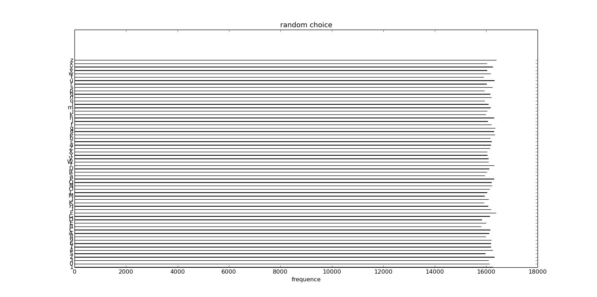

生成全局唯一Id
===========================

参考了: http://www.cnblogs.com/heyuquan/p/global-guid-identity-maxId.html

1. GUID

.. code-block:: python

    import uuid
    uuid.uuid1()

优点： 确保唯一， 速度快

缺点： 太长， 不友好, 不好索引

2. 数据库唯一索引

时间戳加上随机数，然后通过数据库做唯一性校验

.. code-block:: python

    import time
    import random
    import string
    
    m = time.strftime('%y%m%d%H%M%S') + ''.join([random.choice(string.lowercase + string.digits) for _ in range(5)])
    #检查m在数据库中是否存在，存在则重复上述过程，不存在则存入数据库并返回

优点：适合简单应用，id较短，有一定亲和力

缺点：每秒id总数有限制，并发越大性能越低, 加大数据库访问压力，需要锁表

优化：将时间戳转成62进制数

.. code-block:: python

    digit62 = '0123456789ABCDEFGHIJKLMNOPQRSTUVWXYZabcdefghijklmnopqrstuvwxyz'
    #整数转化为62进制字符串
    #入口：
    #   x : 整数
    #返回： 字符串
    def int_to_str62( x ):
        try:
            x=int(x)
        except:
            x=0
        if x<0:
            x=-x
        if x==0:
            return "0"
        s=""
        while x>=62:
            x1= x % 62
            s = digit62[x1]+s
            x = x // 62
        if x>0:
           s = digit62[x]+s 
        return s
    
    #62进制字符串转化为整数
    #入口：
    #   s : 62进制字符串
    #返回： 整数
    def str62_to_int( s ):
        x = 0
        s = str(s).strip()
        if s=="":
            return x
        for y in s:
            k = digit62.find(y)
            if k>=0:
               x=x*62+k
        return x
    
    import time
    import random
    import string

    t = time.strftime('%y%m%d%H%M%S')
    cut = [ t[i:i+2] for i in range(0, len(t), 2) ]
    62t = ''.join([ int_to_str62(int(x)) for x in cut])
    
    m = 62t + ''.join([random.choice(string.lowercase + string.digits) for _ in range(6)])

再ps. 有人说random.choice慢而且随机不均匀，我就写了两个小程序测试一下

.. code-block:: python

    import random
    import time
    import string
    import timeit
    import hashlib
    import uuid
    import threading
    
    def randomchoice():
        return ''.join([ random.choice(string.lowercase + string.digits) for _ in range(6)])
    
    def _time(f, n=1000000):
        print 'start timeit function ', f
        t = timeit.timeit(f, number=n)
        print 'repeat %s times and used %ss' % (n, t)
        print 'end timeit function ', f
        print
    
    _time(randomchoice)

result ::

    start timeit function  <function randomchoice at 0x2a7d6e0>
    repeat 1000000 times and used 3.97338795662s
    end timeit function  <function randomchoice at 0x2a7d6e0>

随机分布 

.. code-block:: python

    from random import choice
    import string
    import collections
    from matplotlib.pyplot import plot, show, barh, yticks, xlabel, title, figure
    import numpy as np
    
    tables = string.ascii_letters + string.digits
    
    counter = collections.Counter()
    
    for _ in range(1000000):
        counter[choice(tables)] += 1
    
    alphats = counter.keys()
    y_pos = np.arange(len(alphats))
    freq = counter.values()
    
    figure(figsize=(100,100))
    barh(y_pos, freq, align='edge', alpha=1, height=0.05)
    yticks(y_pos, alphats)
    xlabel('frequence')
    title('random choice')
    
    show()

结果图:

可见分布还是比较平均的

3. like mongo objectid

   时间 ＋ md5(hostname) + pid + 递增id

.. code-block:: python

    import struct
    import socket
    import os
    import time
    from hashlib import md5
    import threading
    import random
    import binascii
    
    _inc = random.randint(0, 0xFFFFFF)
    _inc_lock = threading.Lock()
    
    oid = ""
    
    oid += struct.pack(">i", int(time.time()))
    
    m = md5()
    m.update(socket.gethostname())
    oid += m.digest()[0:3]
    
    oid += struct.pack(">H", os.getpid() % 0xFFFF)
    
    _inc_lock.acquire()
    oid += struct.pack(">i", _inc)[1:4]
    _inc = (_inc + 1) % 0xFFFFFF
    _inc_lock.release()
    
    print len(oid)
    print binascii.hexlify(oid)
