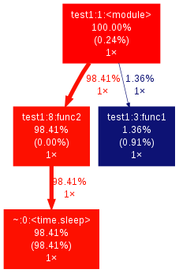

=====================
python 性能profile
=====================

这里说的profile并不是仅仅只是profile，而是指所有有关python性能检测的工具

timeit
===================

使用起来非常简单方便

.. code-block:: python

    In [2]: t = timeit.Timer("x=0")
    
    In [3]: t.timeit()
    Out[3]: 0.019345998764038086

或:

.. code-block:: shell

    python -m timeit "x=0"

profile
=================

profile可以统计每个函数调用次数和运行时间，使用方式也有很多种, 一般为了性能使用cProfile

.. code-block:: python

    In [4]: import cProfile as profile
    
    In [5]: def fun():
    ...:     print 'xxxx'
    ...: 

    In [6]: profile.runctx("fun()", globals(), locals())
    xxxx
    4 function calls in 0.000 seconds

    Ordered by: standard name

    ncalls  tottime  percall  cumtime  percall filename:lineno(function)
       1    0.000    0.000    0.000    0.000 :0(setprofile)
       1    0.000    0.000    0.000    0.000 <ipython-input-5-a906bfd36a72>:1(fun)
       1    0.000    0.000    0.000    0.000 <string>:1(<module>)
       1    0.000    0.000    0.000    0.000 profile:0(fun())
       0    0.000             0.000          profile:0(profiler)

也可以从命令行启动profile来分析

.. code-block:: shell

    python -m cProfile dd.py 
    2 function calls in 0.000 seconds
    
    Ordered by: standard name
    
    ncalls  tottime  percall  cumtime  percall filename:lineno(function)
        1    0.000    0.000    0.000    0.000 dd.py:1(<module>)
        1    0.000    0.000    0.000    0.000 {method 'disable' of '_lsprof.Profiler' objects}

或者将profile数据保存起来供其他方式展示, 以下内容来自： http://chenxiaoyu.org/2013/08/28/python-profile.html

如有以下程序(test1.py)

.. code-block:: python

    import time
    
    def func1():
        sum = 0
        for i in range(1000000):
            sum += i
    
    def func2():
        time.sleep(10)
    
    func1()
    func2()

运行cProfile

.. code-block:: shell

    python -m cProfile -o test1.out test1.py

展示

.. code-block:: shell

    $ python -c "import pstats; p=pstats.Stats('test1.out'); p.print_stats()"
    Wed Nov  6 15:39:39 2013    test1.out
    
    6 function calls in 10.056 seconds
    
    Random listing order was used
    
    ncalls  tottime  percall  cumtime  percall filename:lineno(function)
        1    0.000    0.000   10.056   10.056 test1.py:1(<module>)
        1   10.010   10.010   10.010   10.010 {time.sleep}
        1    0.034    0.034    0.047    0.047 test1.py:3(func1)
        1    0.000    0.000    0.000    0.000 {method 'disable' of '_lsprof.Profiler' objects}
        1    0.000    0.000   10.010   10.010 test1.py:8(func2)
        1    0.013    0.013    0.013    0.013 {range}
    
针对某些列排序

.. code-block:: shell

    $ python -c "import pstats; p=pstats.Stats('test1.out'); p.sort_stats('time').print_stats()"
    Wed Nov  6 15:39:39 2013    test1.out
    
    6 function calls in 10.056 seconds
    
    Ordered by: internal time
    
    ncalls  tottime  percall  cumtime  percall filename:lineno(function)
        1   10.010   10.010   10.010   10.010 {time.sleep}
        1    0.034    0.034    0.047    0.047 test1.py:3(func1)
        1    0.013    0.013    0.013    0.013 {range}
        1    0.000    0.000   10.056   10.056 test1.py:1(<module>)
        1    0.000    0.000   10.010   10.010 test1.py:8(func2)
        1    0.000    0.000    0.000    0.000 {method 'disable' of '_lsprof.Profiler' objects}

最后以图片形式展示一下profile

先安装 gprof2dot.py_ 和 graphviz_

.. _gprof2dot.py: http://gprof2dot.jrfonseca.googlecode.com/git/gprof2dot.py

.. _graphviz: http://www.graphviz.org/Download.php

然后

.. code-block:: shell

    ./gprof2dot.py -f pstats test1.out | dot -Tpng -o test1.png

