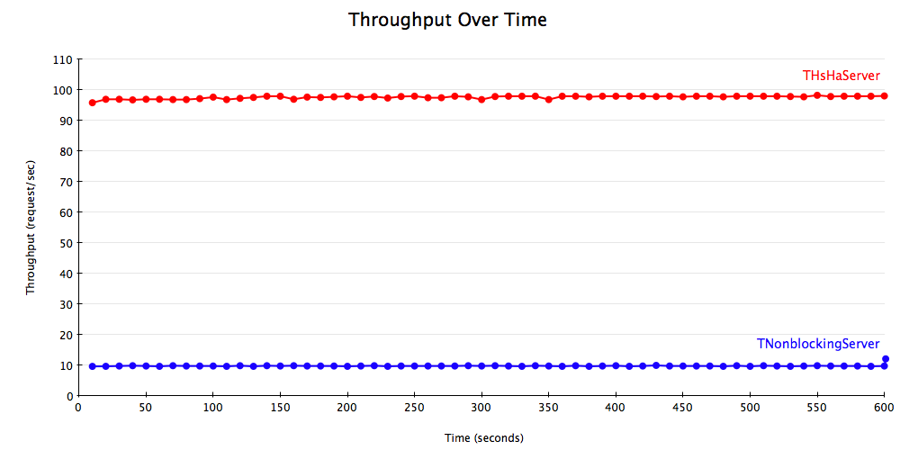
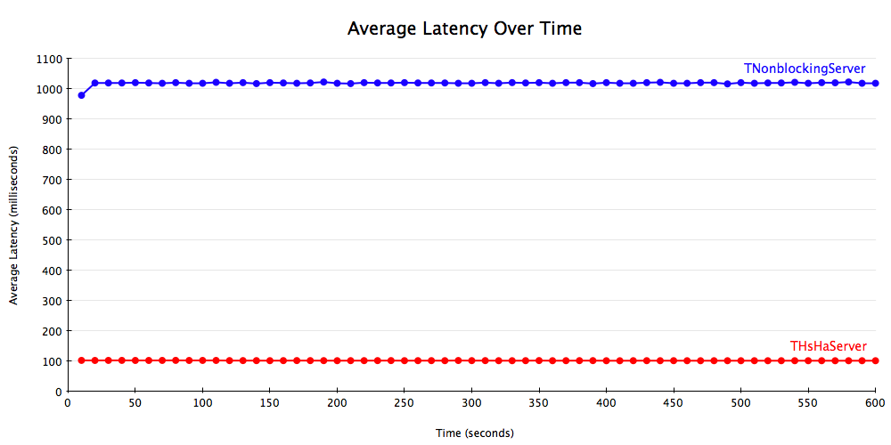
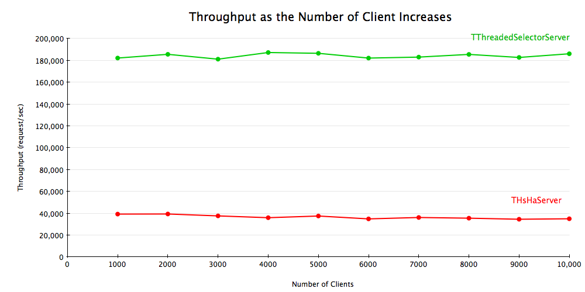
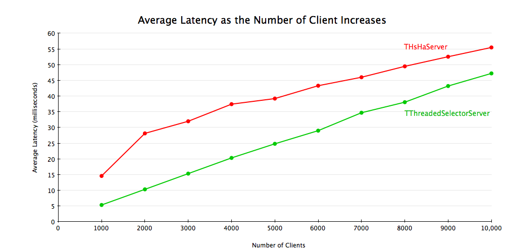
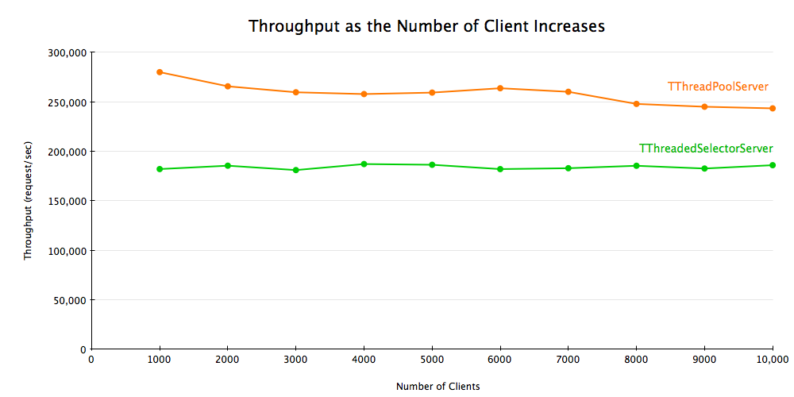
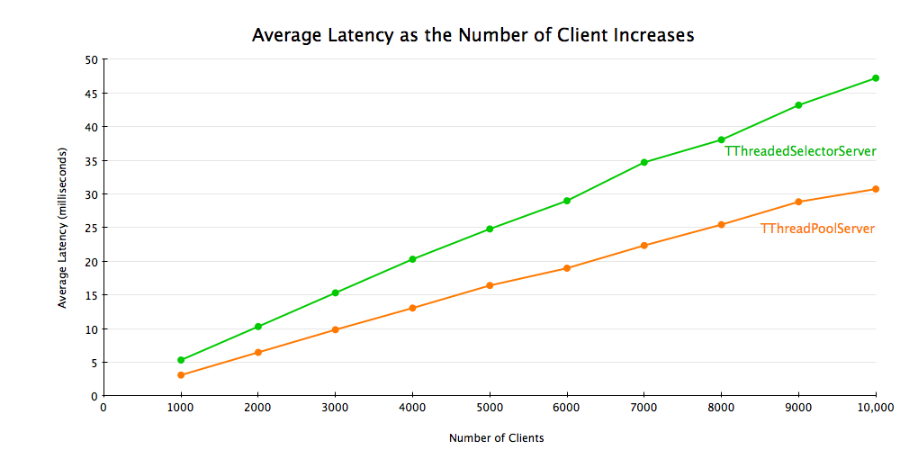

===================================
大数据笔记
===================================

好久都没写过东西了，这个二月份非常非常忙，工作，生活，压力一下子大了起来。本来今天是想看看工作内容的，但实在是没心思了，就找了本书《大数据》看看，顺手记点笔记，也算看过留个东西吧。

第一章
==================================

数据挖掘定义， 数据挖掘是数据模型的发现过程

建模的几个方向：

* 统计建模
* 机器学习

建模的计算方法：

* 数据汇总
* 特征抽取

数据统计限制：

* 整体情报预警
* 邦弗朗尼原理

相关知识：

* TF.IDF
* 哈希函数
* 索引
* 二级存储器
* 自然对数底e

.. math::

  (1+1/x)^x = e

  e^x = 1 + x + x^2/2 + x^3/6 + x^4/24 + .. + x^n/n! + ..

* 幂定律 - 两个变量在对数空间下呈现出线性关系

  很多现象都服从一个可表示成 :math:`y=cx^a` 的定律，其中a是幂， 一个通常的取值是-2左右

第二章 map reduce
=======================

TSimpleServer接收一个连接，处理这个连接上的请求直到client关闭该连接，才去重新接受一个新连接。因为所有事情都在一个线程且是阻塞I/O， 它仅能同时服务一个连接，其他client不得不等待直到被接收。TSimpleServer主要用于测试目的，不要在生产环境中使用。

TNonblockingServer VS THsHaServer
=====================================

TNonblockingServer solves the problem with TSimpleServer of one client blocking all the other clients by using non-blocking I/O. It uses java.nio.channels.Selector, which allows you to get blocked on multiple connections instead of a single connection by calling select(). The select() call returns when one ore more connections are ready to be accepted/read/written. TNonblockingServer handles those connections either by accepting it, reading data from it, or writing data to it, and calls select() again to wait for the next available connections. This way, multiple clients can be served without one client starving others.

TNonblockingServer使用非阻塞I/O解决了TSimpleServer一个client会阻塞所有其他client的问题。它使用 `java.nio.channels.Selector`_, 通过调用select()允许你阻塞在多个连接上而不是一个连接。当一个或多个连接可接受/读/写时 `select()`_ 返回。TNonblockingServer 处理这些连接要么接受连接，要么从此读数据或写数据到连接，并再次调用select()等待下个可用的连接。安装这种方式，可以服务多个client而不会一个client饿死其他client。

.. _`java.nio.channels.Selector`: http://docs.oracle.com/javase/1.4.2/docs/api/java/nio/channels/Selector.html

.. _`select()`: http://docs.oracle.com/javase/1.4.2/docs/api/java/nio/channels/Selector.html#select%28%29

There is a catch, however. Messages are processed by the same thread that calls select(). Let's say there are 10 clients, and each message takes 100 ms to process. What would be the latency and throughput? While a message is being processed, 9 clients are waiting to be selected, so it takes 1 second for the clients to get the response back from the server, and throughput will be 10 requests / second. Wouldn't it be great if multiple messages can be processed simultaneously?

然而，有个棘手问题。消息都是由调用select()的线程来处理的. 让我们假设有10个client，每个消息处理需要100ms。延迟和吞吐量多少？当一个message被处理的时候，其他9个client等待被选择，所以，需要1sclient才能得到server返回的response，吞吐量事10 req/s。如果消息能被同时处理是不是会好很多？

This is where THsHaServer (Half-Sync/Half-Async server) comes into picture. It uses a single thread for network I/O, and a separate pool of worker threads to handle message processing. This way messages will get processed immediately if there is an idle worker threads, and multiple messages can be processed concurrently. Using the example above, now the latency is 100 ms and throughput will be 100 requests / sec.

这就是THsHaServer(半同步/半异步服务)的切入点。它使用单线程处理网络io，和分开的工作线程池处理消息处理。这样如果有空闲的工作线程，消息就会立马被处理，多个消息也能被并行的处理。使用上面的例子，现在延迟事100ms，吞吐量奖是100 req/s.

To demonstrate this, I ran a benchmark with 10 clients and a modified message handler that simply sleeps for 100 ms before returning. I used THsHaServer with 10 worker threads. The handler looks something like this:

为了证明这点，我运行了一个benchmark,有10个client和一个消息处理函数，消息处理仅仅是简单sleep 100ms然后返回。我使用10工作线程的THsHaServer。 handler如下所示::

    public ResponseCode sleep() throws TException
    {   
        try {
            Thread.sleep(100);
        } catch (Exception ex) {
        }
        return ResponseCode.Success;
    }

The results are as expected. THsHaServer is able to process all the requests concurrently, while TNonblockingServer processes requests one at a time.

结果正如期望。THsHaServer能同时并行处理所有请求，而TNonblockingServer一次处理一个。

THsHaServer vs. TThreadedSelectorServer
===============================================

Thrift 0.8 introduced yet another server, TThreadedSelectorServer. The main difference between TThreadedSelectorServer and THsHaServer is that TThreadedSelectorServer allows you to have multiple threads for network I/O. It maintains 2 thread pools, one for handling network I/O, and one for handling request processing. TThreadedSelectorServer performs better than THsHaServer when the network io is the bottleneck. To show the difference, I ran a benchmark with a handler that returns immediately without doing anything, and measured the average latency and throughput with varying number of clients. I used 32 worker threads for THsHaServer, and 16 worker threads/16 selector threads for TThreadedSelectorServer.

Thrift 0.8引入另一种server，TThreadedSelectorServer。TThreadedSelectorServer和THsHaServer最大的不同是允许你有为网络I/O分配多个线程。它保持两个线程池，一个为了处理网络I/O, 一个处理请求。TThreadedSelectorServer在网络io是瓶颈时表现比THsHaServer好。为了显示他们的不同，我运行一个处理函数不做任何事立即返回的benchmark， 并测量不同client数量下的平均延迟和吞吐量。我使用32线程的THsHaServer 和16工作线程/16selector线程的TThreadedSelectorServer。

The result shows that TThreadedSelectorServer has much higher throughput than THsHaServer while maintaining lower latency.

结果显示TThreadedSelectorServer比THsHaServer有更高的吞吐量且更低的延迟。

TThreadedSelectorServer vs. TThreadPoolServer
====================================================

Finally, there is TThreadPoolServer. TThreadPoolServer is different from the other 3 servers in that:

最后是TThreadPoolServer， TThreadPoolServer和其他3个servers不同地方在于：

* There is a dedicated thread for accepting connections.
* Once a connection is accepted, it gets scheduled to be processed by a worker thread in ThreadPoolExecutor.
* The worker thread is tied to the specific client connection until it's closed. Once the connection is closed, the worker thread goes back to the thread pool.
* You can configure both minimum and maximum number of threads in the thread pool. Default values are 5 and Integer.MAX_VALUE, respectively.

* 有一个专用线程接受连接
* 一旦一个连接被接受了，被安排给ThreadPoolExecutor中一个工作线程来处理
* 这个工作线程服务该指定client连接直到关闭。一旦该连接关闭，该工作线程回到线程池
* 你可以配置线程池的最小和最大线程数。对应的默认值事5和Integer.MAX_VALUE

This means that if there are 10000 concurrent client connections, you need to run 10000 threads. As such, it is not as resource friendly as other servers. Also, if the number of clients exceeds the maximum number of threads in the thread pool, requests will be blocked until a worker thread becomes available.

这意味着如果有10000个并发client连接，你需要运行10000个线程。就本身而论，这不如其他servers对资源友好。并且，如果client的数量超过线程池的最大数值，请求将被阻塞住直到有工作线程可用。

Having said that, TThreadPoolServer performs very well; on the box I'm using it's able to support 10000 concurrent clients without any problem. If you know the number of clients that will be connecting to your server in advance and you don't mind running a lot of threads, TThreadPoolServer might be a good choice for you.

话虽如此，TThreadPoolServer表现的非常好；我用它支撑10000个并发连接没有任何问题。如果你能提前知道你的client数目并且也不介意多一点线程，TThreadPoolServer对你可能是个好选择。

Conclusion
==================

I hope this article helps you decide which Thrift server is right for you. I think TThreadedSelectorServer would be a safe choice for most of the use cases. You might also want to consider TThreadPoolServer if you can afford to run lots of concurrent threads. Feel free to send me email at mapkeeper-users@googlegroups.com or post your comments here if you have any questions/comments.

我希望这篇文章能帮你决定哪种Thrift server适合你。 我觉得对于多数情况TThreadedSelectorServer是个安全的选择。如果你你可以接受运行大量并发进程，你也可以考虑TThreadPoolServer。

Appendix A: Hardware Configuration
========================================

::

    Processors:     2 x Xeon E5620 2.40GHz (HT enabled, 8 cores, 16 threads)
    Memory:         8GB
    Network:        1Gb/s <full-duplex>
    OS:             RHEL Server 5.4 Linux 2.6.18-164.2.1.el5 x86_64

Appendix B: Benchmark Details
=========================================

pass
