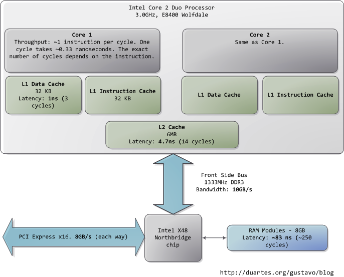
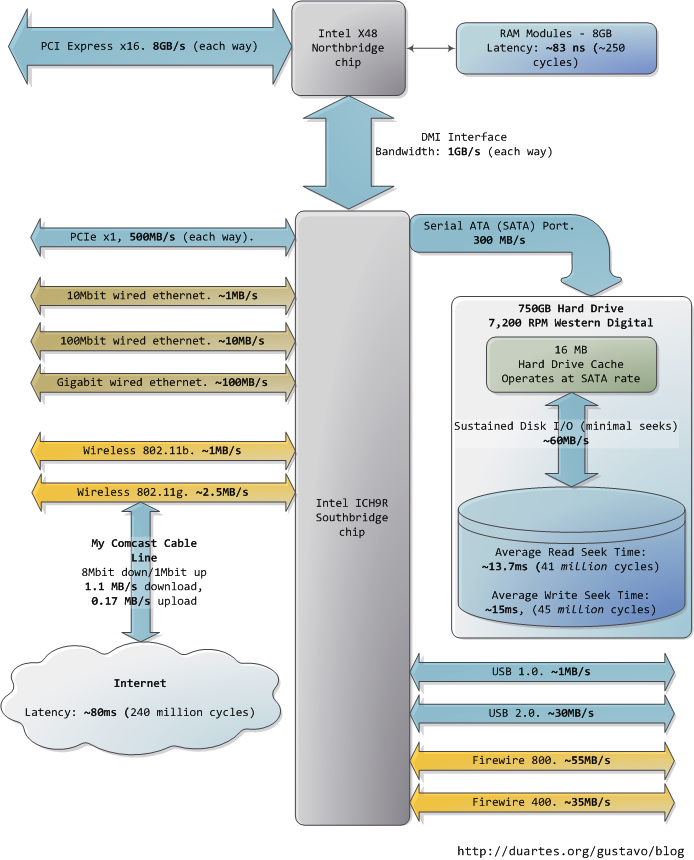

======================================================
Understanding CPU utilization
======================================================

进程类型
=============================

交互式进程不断与用户之间交互，因此大部分时间等待键盘按键和鼠标操作。但收到输入， 进厂必须马上唤醒，否则用户会觉得系统反应迟钝。一般来说，平均延迟必须小于50到150毫秒。延迟的变动也必须有界，否则用户会发现系统不稳定。典型的交互程序有命令行，文本编辑器和图像软件。

批处理进程不叙永用户交互，因此经常在后台运行。因为此类进程不需很快的反应， 所以他们常被调度器惩罚。典型的批处理程序有编译器，数据库搜索引擎和科学技术等。

linux2.6 调度器使用了一个设计精巧复杂的算法, 该算法会基于进程过往的行为来决定一个进程应该被当作交互程序还是批处理程序。当然，相比批处理程序，调度器更倾向于喜欢交互进程。

实时进程有非常严格的调度要求。此类进程应从不会被低优先级的进程阻塞并在很低变化下有最低保证反应时间。典型的实时程序有视频和音频程序，机器人控制以及从物理感应器上收集数据的程序。（进程的优先级小于100)

动态和静态优先级
===============================

静态优先级是分配给进程的优先级。它决定了分配给每个进程的时间分片(100 是 800ms, 120 是 100ms， 139是5ms). 一个新的进程继承它父进程的静态优先级。但是，用户可以使用nice更改静态优先级. 所有的进程起始有个默认的优先级，默认值120.

动态优先级是基于进程的平均睡眠时间合理真假或减小静态优先级。动态优先级决定了进程在运行队列(run queue)中的位置

进程调度
=============================

linux进程（LWPs(light wieght processes)和进程是同样的调度）是抢占式。但一个进程进入TASK_RUNNING状态，内核检查他的动态优先级是否大于当前正在运行进程的优先级。如果是，当前执行的进程被中断，调用调度器选择另一个进程执行（通常是刚可以runable的）。当然，一个进程当其时间分片到时时也会被抢占。注意，被抢占进程不是被暂停，因为它的状态还是TASK_RUNNING，只是简单的不再使用cpu

进程调度算法粗览
=============================

* 选择一个进程
* 如果一个新进程进入队列-如果它的优先级大于这个进程，则pre_empt. 如果不是，放入队列
* 进程是否完成
  * 是：时间分片已到期
    * 是：退出
    * 否： 激活队列，从队列中选取最高优先级进程（如果队列空则失效队列）并重复
* 时间分片已到期
  * 否：活动队列
  * 是： 进程是个交互进程
    * 否： 失效队列
    * 是： 是否有高优先级的过期进程或者上次执行以来过去很长时间的进程
      * 是：将进程放入失效队列
      * 否： 讲进程放入活动队列
* 从活动队列（如果空则是失效队列）选取最高优先级的进程并重复

上面的过程确保了如下：
* 动态优先级高的进程总能立马抢占动态优先级低的进程
* 一个进程不能独占cpu超过由静态优先级决定的x毫秒
* 交互进程比批处理更高优先级
* 任何进程用完它的时间分片必须等待直到其他相同或更高优先级进程执行完

上下文切换开销
===================================

为了控制进程的运行, 内核必须能暂停当前在cpu上执行的进程和恢复以前被暂停的进程执行。这个被称为进程切换，任务切换或上下文切换. 一个上下文切换可能是自愿的-当一个进程在分配给它的时间分片消化完之前完成工作或者因为调用一个阻塞IO操作而进入暂停状态。非此即彼，一个上下文切换可能是非自愿的如进程使用完分配给他的cpu分片时间，内核会抢占该进程并切换出去将cpu授予run queue中其他进程。暂停第一个进程和调度第二个需要内核保存一个进程的状态以及加载第二个进程的状态。它的开销和需要的时间被认为是上下文切换的开销。

自愿上下文切换的数量可被用于推断进程被阻塞的频率.另一方面,非自愿上下文切换意味着进程争夺cpu,尽管他们的任务还没执行完但不得不被切换出去.

* 上下文切换的绝对数量会一直增长
* 每个上下文切换的开销也会增加. 只有少量进程时,所需数据的大部分或所有都可在CPU caches里.然而当有大量进程时,进程的上下文数据在CPU casees的概率就小.因此每个上下文需要从内存获取数据,这比从cpu caches取同样数据昂贵. 事实上,昂贵是由于切换出去进程的数据必须提交到RAM和切换进来的进程必须从RAM加载数据混合所致. 这两个操作都会发生否则是发生在cache. 例如, 在intel Pentium M 从L1 cache读数据大概3个cpu周期而从内存读取同样数据需要240个周期.因此增加进程数量超过一个点将以指数方式增长每个上下文切换的消耗和时间.
* 上下文切换开销同样也会增加普通用户空间进程开销.一个典型用户空间进程需要的指令和数据可以同样在CPU L1/L2 cache,但是过多不同的进程需要的指令和数据可能需要从RAM获取.这个开销可能不会出现在%system(这点未确定)
* 当上下文切换增加, 每个进程延迟增加.每个耗时30微妙上下文切换,10个进程的结果附加给每个进程获得CPU前0.3毫秒的延迟,另一方面,上下文切换300微妙,500个进程导致的是每个进程获得CPU前的150ms延迟,这比每个进程的CPU时间还多.

综上所述, 显著增加进程数量会导致相当的cpu损耗.事实上, 当进程数量增加到一个点, 它们的累积数据不再适应cpu cache, 人们能看到显著的上下文切换延迟.因此, 在任何机器上,不能武断的增加进程数量, 这点非常重要.

换一种理解方式, 如果一个给定进程的上下文切换耗时1/100的实际cpu时间, 则100个运行进程将导致一半的cpu时间用于进程切换并且对于每个进程双倍的延迟.

Impact of locks and increase in processes/threads
======================================================

如果你的代码有同步块或锁, 多个线程会增加争用和增加总cpu时间

CPU caches
========================

cache 替换算法像LRU

Monitoring CPU
=========================

/proc/stat

/proc/cpuinfo

sys/devices/system/cpu/cpu0/cache/

::

  [bhavin.t@m1-sv-xbox2 ~]$ cat /sys/devices/system/cpu/cpu0/cache/index0/size
  32K

  [bhavin.t@m1-sv-xbox2 ~]$ cat /sys/devices/system/cpu/cpu0/cache/index2/size
  6144K

/proc/loadavg

/proc/<pid>/status

top

::
 
  In top overall CPU utilization is broken down into -

  us - Percentage of CPU time spent in user space
  sy - Percentage of CPU time spent in kernel space
  ni - Percentage of CPU time spent on low priority processes
  id - Percentage of CPU time spent idle and there was no outstanding disk IO request
  wa - Percentage of CPU time spent in wait (on disk)
  hi - Percentage of CPU time spent handling hardware interrupts
  si - Percentage of CPU time spent handling software interrupts

上面所有加起来是100%. 在多核机器上,这个数字表现的是累加平均.相应你可以按1开关以察看单个cpu. 处理中断耗时百分比应该是可以忽略的.

%user: This represents actual cpu time spent by applications and processes in user space. If this is high you can do one of (1) increase cpu capacity (2) optimize your application code (3) horizontal partitioning. A high %user means your application is cpu bound and the cpu is being utilized in an optimal way (the application itself may not be optimal - but the cpu cycles are not being wasted)

%system: This represents cpu time spent in kernel code execution. This represents system calls made by applications, and time spent in context switching. If the number of processes in the run queue increase substantially this value can go up denoting a high number of context switches. Outside of the time spent in actual kernel calls, any time spent in context switching by the CPU is a waste of time. Context switching time cannot be avoided altogether especially when the processes also engage in IO. This is discussed in detail further down

%iowait: This represents the percentage of time when a CPU was idle and the system had an outstanding disk IO request waiting to complete. This figure does not include network IO. Therefore if there was an outstanding disk request while the CPU was waiting then the idle time is counted within %iowait. Note that waiting on any network filesystem (iSCSI/NFS) would also be counted in this. A high %iowait is an indicator of storage bottlenecks but not an indicator of storage saturation since %iowait is merely measuring cpu idle time. For instance take an operation which consumes 40ms cpu time and 40ms disk io time. The %iowait would show up as 50%. Now in the same system if we upgrade the CPU to something 4x more powerful, the cpu time would reduce to 10ms and the disk io time would remain at 40ms. This would result in an iowait of 80%. Neither of these indicate that the storage system is saturated. It merely indicates that the CPU is significantly faster.

    %iowait: This represents the percentage of time when a CPU was idle and the system had an outstanding disk IO request waiting to complete. This figure does not include network IO. Therefore if there was an outstanding disk request while the CPU was waiting then the idle time is counted within %iowait. Note that waiting on any network filesystem (iSCSI/NFS) would also be counted in this. A high %iowait is an indicator of storage bottlenecks but not an indicator of storage saturation since %iowait is merely measuring cpu idle time. For instance take an operation which consumes 40ms cpu time and 40ms disk io time. The %iowait would show up as 50%. Now in the same system if we upgrade the CPU to something 4x more powerful, the cpu time would reduce to 10ms and the disk io time would remain at 40ms. This would result in an iowait of 80%. Neither of these indicate that the storage system is saturated. It merely indicates that the CPU is significantly faster.)i vtk 

mpstat and vmstat
===================================

mpstat and vmstat provide the same stats as top. mpstat additionally provides interrupts recvd per second

/proc/status ::

    cat /proc/$$/status

/proc/<pid>/stat

::

    [user@server ~]$ cat /proc/7278/stat
    7278 (postgres) S 1 7257 7257 0 -1 4202496 36060376 10845160168 0 749 20435 137212 158536835 39143290 15 0 1 0 50528579 3763298304 20289 18446744073709551615 4194304 7336916 140734091375136 18446744073709551615 225773929891 0 0 19935232 84487 0 0 0 17 2 0 0 12

    The fields, in order, are:

    pid: The process ID.
    comm: The filename of the executable, in parentheses. This is visible whether or not the executable is swapped out.
    state: One character from the string "RSDZTW" where R is running, S is sleeping in an interruptible wait, D is waiting in uninterruptible disk sleep, Z is zombie, T is traced or stopped (on a signal), and W is paging.
    ppid: The PID of the parent.
    pgrp: The process group ID of the process.
    session: The session ID of the process.
    tty_nr: The controlling terminal of the process. (The minor device number is contained in the combination of bits 31 to 20 and 7 to 0; the major device number is in bits 15 to 8.)
    tpgid: The ID of the foreground process group of the controlling terminal of the process.
    utime: Amount of time that this process has been scheduled in user mode, measured in clock ticks (divide by sysconf(_SC_CLK_TCK). This includes guest time, guest_time (time spent running a virtual CPU, see below), so that applications that are not aware of the guest time field do not lose that time from their calculations.
    stime: Amount of time that this process has been scheduled in kernel mode, measured in clock ticks (divide by sysconf(_SC_CLK_TCK).
    cutime: Amount of time that this process's waited-for children have been scheduled in user mode, measured in clock ticks (divide by sysconf(_SC_CLK_TCK). (See also times(2).) This includes guest time, cguest_time (time spent running a virtual CPU, see below).
    cstime: Amount of time that this process's waited-for children have been scheduled in kernel mode, measured in clock ticks (divide by sysconf(_SC_CLK_TCK).
    priority: (Explanation for Linux 2.6) For processes running a real-time scheduling policy (policy below; see sched_setscheduler(2)), this is the negated scheduling priority, minus one; that is, a number in the range -2 to -100, corresponding to real-time priorities 1 to 99. For processes running under a non-real-time scheduling policy, this is the raw nice value (setpriority(2)) as represented in the kernel. The kernel stores nice values as numbers in the range 0 (high) to 39 (low), corresponding to the user-visible nice range of -20 to 19. Before Linux 2.6, this was a scaled value based on the scheduler weighting given to this process.
    nice: The nice value (see setpriority(2)), a value in the range 19 (low priority) to -20 (high priority).
    num_threads: Number of threads in this process (since Linux 2.6). Before kernel 2.6, this field was hard coded to 0 as a placeholder for an earlier removed field.
    starttime: The time in jiffies the process started after system boot.
    wchan: This is the "channel" in which the process is waiting. It is the address of a system call, and can be looked up in a namelist if you need a textual name. (If you have an up-to-date /etc/psdatabase, then try ps -l to see the WCHAN field in action.)
    processor: (since Linux 2.2.8) CPU number last executed on.
    rt_priority: (since Linux 2.5.19; was: before Linux 2.6.22) Real-time scheduling priority, a number in the range 1 to 99 for processes scheduled under a real-time policy, or 0, for non-real-time processes (see sched_setscheduler(2)).
    policy: (since Linux 2.5.19; was: before Linux 2.6.22) Scheduling policy (see sched_setscheduler(2)). Decode using the SCHED_* constants in linux/sched.h.
    guest_time: (since Linux 2.6.24) Guest time of the process (time spent running a virtual CPU for a guest operating system), measured in clock ticks (divide by sysconf(_SC_CLK_TCK).
    cguest_time:ld (since Linux 2.6.24) Guest time of the process's children, measured in clock ticks (divide by sysconf(_SC_CLK_TCK).

pid

pidstat

vmstat for context switch
======================================

shows system wide context switches per time interval

procs ----------memory--------- --swap- ----io--- -system- ----cpu-----
r b swpd free buff cache si so bi bo in cs us sy id wa st
3 0 129464 1123196 285984 33670292 0 0 40 9392 3653 13481 2 4 93 0 0
1 0 129464 1121504 285984 33670664 0 0 20 2702 3447 11445 1 3 96 0 0
0 0 129464 1121744 285984 33670968 0 0 0 5509 3565 14130 1 3 96 0 0

Context switching takes place in kernel space and so its cpu utilization is available within %system. As you see above in the first row the context switches are 13481/second with a %system cpu utilization of 2%. You can increase processes and monitor this variable to determine the impact on the number of context switches as well as the corresponding increase in %system utilization.

perf tools

Optimizing CPU utilization
=============================================

Optimal CPU utilization with respect to processes
=====================================================

理想情况,我们喜欢让cpu保持适度繁忙.任何时候使用cpu而不是实际的任何都是浪费cpu时间.

::

    Here is a model for iteratively optimizing cpu utilization -

    Start with a certain thread/process count (possibly marginally more than your cpu cores)
    If at peak loads CPU utilization shows a high %iowait
    Check disk utilization. If your disk is saturated fix that
    If your disk is not saturated consider increasing IO speeds (higher RPM disks, flash drives or flashcache). This results in disk operations completing faster reducing the amount of time a process goes into blocked state, and thus increasing the amount of time a process is scheduled to run on the cpu
    If you are seeing page faults then you need to either resolve memory leaks in your application, increase the amount of memory provided to the application or increase your RAM. Your system should never page fault (except when a process or a part of it is being loaded for the first time)
    Additionally even if you are not seeing any page faults, you can invest in additional RAM, thus increasing the size of the OS buffer cache, reducing the number of IO requests required to be sent to the disk. Note that this can only help if your IO load is read intensive, and if a reasonable portion of the frequently read data can fit within the RAM.
    After checking all the above and making the relevant changes once again take a look at the %iowait number. If you have adequate RAM, fast disks, and your disk is not saturated then this number tells you what % of the CPU is now free for additional processes. Once again if you see that the %iowait number is high, you can bump up your active process count proportionately
    If at peak loads your CPU utilization shows idle
    Your application may have blocking network calls. You ought to switch to NIO
    Your application may have other blocking calls (locks, syncrhonized code blocks). Try and eliminate them
    Once eliminated if you continue to see high %idle you can increase your number of processes
    If at peak loads you are seeing high %system values -
    Your cpu maybe wasting time in context switching
    Try and optimize your code to reduce the size of the code and data per process so that instructions and data of each process can fit within the cpu L2 cache
    You may want to experiment with cpu affinity
    Note the above must be adjusted to suit your utilization goals. If you wish to have your CPU utilized 60% of the time, you need to accordingly adjust the active process count downwards

Ideal models for reducing context switching
==================================================

...

===========================================
What Your Computer Does While You Wait
===========================================

一台个人电脑各个部分的延迟和吞吐量, 时间的单位是纳秒（ns，十亿分之一秒），毫秒（ms，千分之一秒），和秒（s）。吞吐量的单位是兆字节（MB）和千兆字节（GB）:

CPU(Intel Core2 Duo 3.0GHz): 

  核心, 大部分指令执行只需一个时钟周期,约1/3纳秒, 即使是真空中传播的光，在这段时间内也只能走10厘米
  L1 Cache, 32KB, 延迟3个时钟周期, 1ns
  L2 Cache, 6MB, 延迟14 cycles, 4.7ns

前端总线 1333MHz DDR3, 带宽 10GB/s 与北桥芯片相连
PCI Express x16. 8GB/s
RAM 8GB 延迟 250 cycles, 83ns

DMI Interface, 1GB/s 连接南北桥芯片

Serial ATA(SATA) Port, 300MB/s
750GB Hard Drive 7200 RPM 西捷:
  Hard Drive Cache, 16MB
  Sustanied Disk IO(minimal seek) , ~60MB/s
  平均读寻址时间: 41 million cycles, 13.7ms
  平均写寻址时间: 45 million cycles, 15ms
  

PCIe x1, 500MB/s
10Mbit wired ethernet, 1MB/s
100Mbit wired ethernet, 10MB/s
1000Mbit wired ethernet, 100MB/s

Wireless 802.11b, 1MB/s
Wireless 802.11g, 2.5MB/s

Internet, 延迟 240 million cycles, 约80ms

