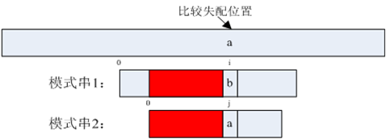

==========================
Aho-Corasick算法
==========================

Aho-Corasick 自动机算法（简称AC自动机）1975年产生于贝尔实验室。该算法应用有限自动机巧妙地将字符比较转化为了状态转移。此算法有两个特点，一个是扫描文本时完全不需要回溯，另一个是时间复杂度为O(n)，时间复杂度与关键字的数目和长度无关。

ref: http://blog.csdn.net/sealyao/article/details/4560427

一个模拟器：

.. image:: http://www.ivank.net/blogspot/en/AHODrawing.swf
    :height: 500px
    :width: 650 px
    :scale: 100 %
    :alt: alternate text
    :align: center

aho-corasick建立树过程
--------------------------

  将关键字建立起一颗Tire树

  设置第一层的不匹配的转移节点

  设置其余的不匹配转移节点

  初始化状态到根节点

aho-corasick定义:
---------------------------

在预处理阶段，AC自动机算法建立了三个函数，转向函数goto，失效函数failure和输出函数output，由此构造了一个树型有限自动机。

转向函数，指的是一种状态之间的转向关系。g(pre, x)=next：状态pre在输入一个字符x后转换为状态next（上图中的实线部分）。如果在模式串中不存在这样的转换，则next=failstate。

失效函数，指的也是状态和状态之间一种转向关系。f(per)=next：是在比较失配的情况下使用的转换关系。在构造转向函数时，把不存在的转换用failstate表示，但是failstate不是一个具体的状态，状态机转换转换到failstate状态的时候就不知道该往哪转了。所以就要在状态机中找到一个有意义的状态代替failstate，当出现failstate状态时，自动切换到那个状态。

这个状态节点应该具有这样的特征：从这个状态节点向上直到树根节点（状态0）所经历的输入字符，和从产生failstate状态的那个状态节点向上所经历的输入字符串完全相同。而且这个状态节点，是所有具备这些条件的节点中深度最大的那个节点。如果不存在满足条件的状态节点，则失效函数为0。

说来说去，失效函数就是要干这么件事儿：

意思就是说，在比较模式串1发生失配时，找一个模式串2，使得P2[0...j-1] = P1[i-j+1...i]。然后继续比较模式串2。看上面那个图，想起点儿什么东西没有？对了，是KMP算法。有人说AC算法就是KMP算法在多模式匹配情况下的扩展。

输出函数，指的是状态和模式串之间的一种关系。output(i)={P}，表示当状态机到达状态i时，模式串集合{P}中的所有模式串可能已经完成匹配。

实现
=====================

使用redis特性实现的ac自动机算法，地址: https://github.com/largetalk/redis-ac-keywords
