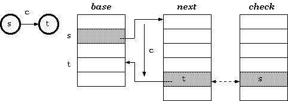
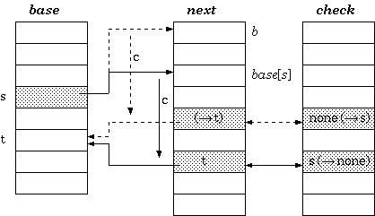
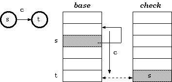

=======================
Double Array Trie
=======================

An Implementation of Double-Array Trie: http://linux.thai.net/~thep/datrie/datrie.html

Trie 是查找树的一种，是单词 Retrieval 的缩写。

Trie也是一种DFA(确定性有限自动机)。Trie树结构中每个节点对应一个DFA状态，每个（有向的）被标记的从父节点到子节点的边相当于一个DFA状态转换。从根节点开始遍历，从头到尾，字符串中一个接一个的字符决定了下个状态的走向。 ......

从根到叶子遍历Trie树所花时间不取决于树的大小，而取决于搜索串key的长度，因此，一般情况下Trie比B树和基于比较的索引方法快，他的时间复杂度和hash方法差不多。

.. image:: ../_static/img/trie1.gif

What Does It Take to Implemnet a Trie
============================================

一般是通过"转换表"来表示DFA, 表中行对应状态，列对应转换标示， 单元格中存的是在当前状态下且输入等于转换标示时的下个状态。

转换表方法有效但太耗内存。

Tripple-Array Trie
=======================

tripple-array 结构由以下组成：

base: base中每个元素对应trie中的一个节点，对于一个trie节点s, base[s]是包括next和check数组的开始的索引， 对应于转换表中的node s.

next: 和check相对应，为转换表中的稀疏vector行提供分配池，vector的数据，就是每个节点的转换向量，会存在数组中。

check: 这个数组和next并列。它标记next中每个单位的owner. 这使得不同cell分配给不同Trie节点。这意味着，从多于一个节点的稀疏转换允许重叠。

  check[base[s] + c] = s
  
  next[base[s] + c] = t

walking
-------------------

walking算法，对于给定状态s, 输入字符c:

.. code-block:: pascal

    t := base[s] + c;
    
    if check[t] = s then
        next state := next[t]
    else
        fail
    endif

construction
-------------------

要插入一个转换，该转换接受字符c从状态s转成状态t, next[base[s]＋c]必须是可用的，如果其正好是空的，我们很幸运。否则，要么该cell的当前所有者的整个转换向量或状态s本身要relocated. 通过估计代价来决定移动哪个。在找到空闲槽可以放置vector之后，转换向量必须重新如下计算。假设新的地址从b开始，relocate程序是:

.. code-block:: pascal

    Procedure Relocate(s : state; b : base_index)
    { Move base for state s to a new place beginning at b }
    begin
        foreach input character c for the state s
        { i.e. foreach c such that check[base[s] + c]] = s }
        begin
            check[b + c] := s;     { mark owner }
            next[b + c] := next[base[s] + c];     { copy data }
            check[base[s] + c] := none     { free the cell }
        end;
        base[s] := b
    end

Double-Array Trie
============================

三数组结构的trie树似乎定义的很好，但实际不能保存在单文件中。next和check数组可能可以保存在单个整数对的数组里，但base不会同步的增长，因此它通常是分割开的。

双数组定义：

check[base[s] + c] = s

base[s] + c = t

walking
---------------------

walking算法:

.. code-block:: pascal

    t := base[s] + c;
    
    if check[t] = s then
        next state := t
    else
        fail
    endif

construction
---------------------

和三数组类似:

.. code-block:: pascal

    Procedure Relocate(s : state; b : base_index)
    { Move base for state s to a new place beginning at b }
    begin
    foreach input character c for the state s
        { i.e. foreach c such that check[base[s] + c]] = s }
        begin
            check[b + c] := s;     { mark owner }
            base[b + c] := base[base[s] + c];     { copy data }
            { the node base[s] + c is to be moved to b + c;
            Hence, for any i for which check[i] = base[s] + c, update check[i] to b + c }
            foreach input character d for the node base[s] + c
            begin
                check[base[base[s] + c] + d] := b + c
            end;
            check[base[s] + c] := none     { free the cell }
        end;
        base[s] := b
    end
