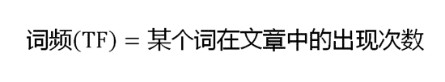
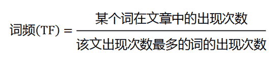

=====================
nlp之gensim
=====================

Basic Concept
===================

TF: Term Frequence 计算方法如下：

IDF: Inverse Document Frequence

.. image:: ../_static/img/nlp/bg2013031506.png

TF-IDF:

.. image:: ../_static/img/nlp/bg2013031507.png

cosine similiarity: 余弦相似度

SVD, Singular value decomposition: 奇异值分解

http://www.cnblogs.com/LeftNotEasy/archive/2011/01/19/svd-and-applications.html

http://www.ling.ohio-state.edu/~kbaker/pubs/Singular_Value_Decomposition_Tutorial.pdf

http://cs.fit.edu/~dmitra/SciComp/Resources/singular-value-decomposition-fast-track-tutorial.pdf

LSI: Latent Semantic Indexing 浅层语义索引

http://www.ce.yildiz.edu.tr/personal/banud/file/1201/latent-semantic-indexing-fast-track-tutorial.pdf

http://blog.csdn.net/zjhzyzc/article/details/5725630

LSA: Latent Semantic Analysis 浅层语义分析

http://www.cnblogs.com/kemaswill/archive/2013/04/17/3022100.html

http://blog.csdn.net/yihucha166/article/details/6795112

LDA: Linear Discriminant Analysis 线性判别分析

http://www.cnblogs.com/zhangchaoyang/articles/2644095.html

http://blog.csdn.net/warmyellow/article/details/5454943

LDA: Latent Dirichlet allocation 

http://blog.csdn.net/huagong_adu/article/details/7937616

http://stblog.baidu-tech.com/?p=1190

http://www.52nlp.cn/lda-math-%E6%B1%87%E6%80%BB-lda%E6%95%B0%E5%AD%A6%E5%85%AB%E5%8D%A6

PCA: Principal component analysis 主成成分分析

http://www.cnblogs.com/LeftNotEasy/archive/2011/01/08/lda-and-pca-machine-learning.html

http://tttl1988.blog.163.com/blog/static/13603644020103199492663/
