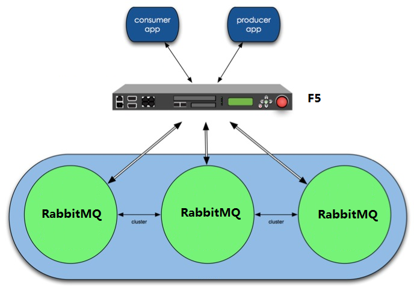

======================================
部署High Availability的RabbitMQ
======================================

整体架构
===================

服务器配置
========================

配置/etc/rabbitmq/rabbitmq.config文件

在 `RabbitMQ配置文件`_ 中设置集群节点::

    [
      {rabbit, [
            {cluster_nodes, {['rabbit@rabbit1', 'rabbit@rabbit2'], disc}}
      ]}
    ].

.. _`RabbitMQ配置文件`: http://www.rabbitmq.com/configure.html#configuration-file

注:

  * "rabbit1"、 "rabbit2"为hostname
  * hostname的解析在/etc/hosts中设置
  * erlang cookie的设置参看 `initial setup`_
  * 可能需要rabbitmqctl stop_app && rabbitmqctl reset让配置起效

.. _`initial setup`: https://www.rabbitmq.com/clustering.html

配置镜像策略::

    sudo rabbitmqctl set_policy -p vhost ha-all-reporting "^reporting\." '{"ha-mode":"all", "ha-sync-mode":"automatic"}'
    sudo rabbitmqctl set_policy -p vhost ha-all-uts "^uts\." '{"ha-mode":"all", "ha-sync-mode":"automatic"}'
    sudo rabbitmqctl set_policy -p vhost  ha-celery "^celery" '{"ha-mode":"all", "ha-sync-mode":"automatic"}'
    sudo rabbitmqctl set_policy -p vhost  ha-email "^email" '{"ha-mode":"all", "ha-sync-mode":"automatic"}'

客户端配置
======================

客户端包括“producer app”和“consumer app”

 队列创建
-----------------

在代码中创建队列时，需要声明策略("x-ha-policy":"all")，如使用Kombu开发时::

    q = Queue("queue_name", exchange, "bingding_key", queue_arguments={'x-ha-policy':'all'}) 

连接配置
---------------------

在客户端代码中配置的RabbitMQ地址应该是F5虚地址

Celery相关
------------------------

当使用Celery进行开发时，可遵循下面的设置以支持RabbitMQ HA

settings.py::

    CELERY_ACKS_LATE = True
    CELERY_QUEUE_HA_POLICY = 'all'
    CELERYD_MAX_TASKS_PER_CHILD = 200  #若设置了该参数，可能会造成worker hang， 需要使用CELERYD_FORCE_EXECV=True来避免
    CELERYD_FORCE_EXECV = True

Celery APP:

在HA环境测试中，RabbitMQ服务器进行故障切换时，有可能造成消息发送“失败”，但客户端并不知道未发送成功,
因此，Celery使用的TaskProducer需要使用事务，示例代码::

    import os
    from celery import Celery
    from celery.app import amqp
    
    class TxTaskProducer(amqp.TaskProducer):
        def _publish(self, *args, **kwargs):
            self.channel.tx_select()
            try:
                return super(TxTaskProducer, self)._publish(*args, **kwargs)
            finally:
                self.channel.tx_commit()
    
    class TxAMQP(amqp.AMQP):
        producer_cls = TxTaskProducer
    
    class TxCelery(Celery):
        amqp_cls = 'biz.app:TxAMQP'
    
    _current = TxCelery(
        'default',
        loader=os.environ.get('CELERY_LOADER') or 'default',
        set_as_current=True, accept_magic_kwargs=True,
    )

OR::

    from kombu.messaging import Producer
    _publish_ = Producer._publish
    
    def _publish(self, *args, **kw):
        self.channel.tx_select()
        try:
            return _publish_(self, *args, **kw)
        finally:
            self.channel.tx_commit()
    Producer._publish = _publish

测试环境测试
===================

在测试环境中可以使用haproxy 来代替F5模拟测试， haproxy示例配置如下::

    global
            maxconn 4096
            daemon
    
    defaults
            mode    http
            option  dontlognull
    
    listen  rabbitmq 0.0.0.0:56720
            mode    tcp
            balance roundrobin
            option  tcpka
            server  rabbit1 172.16.21.144:5672 check inter 2000 downinter 500
            server  rabbit2 172.16.21.145:5672 check inter 2000

参考文章
===================

`Highly Available Queues`_

`Clustering Guide`_

`RabbitMQ使用IP地址配置集群模式`_

.. _`Highly Available Queues`: https://www.rabbitmq.com/ha.html
.. _`Clustering Guide`: https://www.rabbitmq.com/clustering.html
.. _`RabbitMQ使用IP地址配置集群模式`: http://fengchangjian.com/?p=1976
